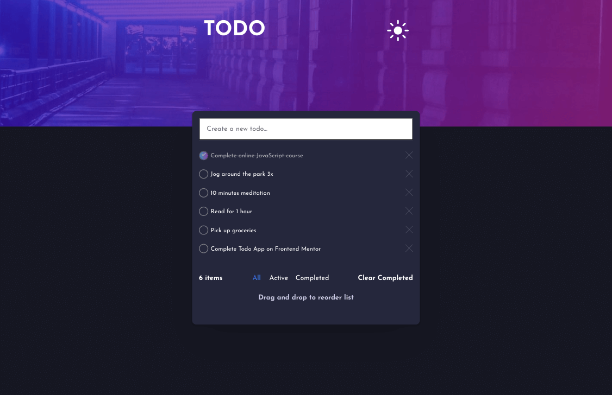
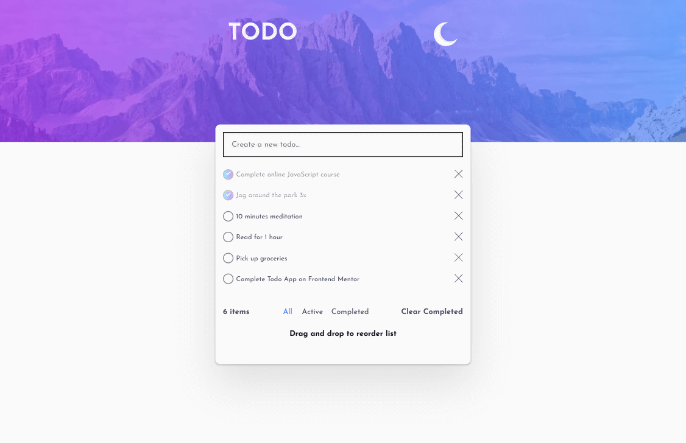
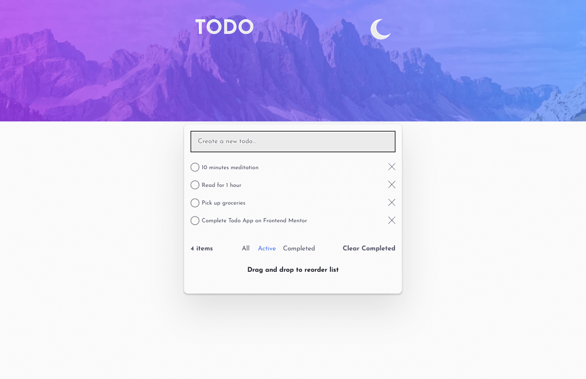
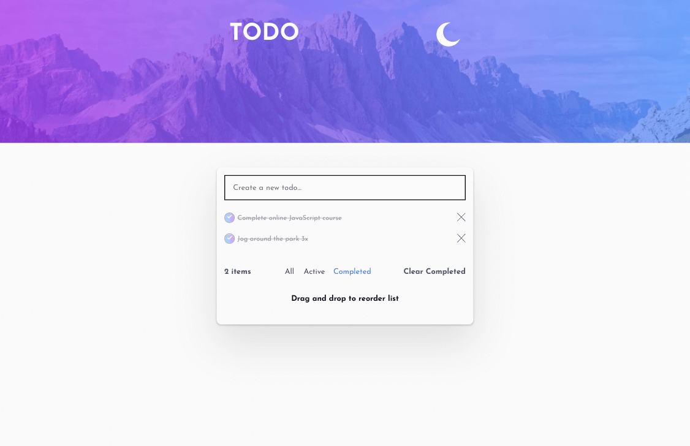
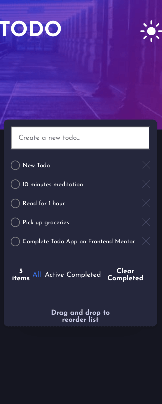

# Frontend Mentor - Todo app solution

This is a solution to the [Todo app challenge on Frontend Mentor](https://www.frontendmentor.io/challenges/todo-app-Su1_KokOW). Frontend Mentor challenges help you improve your coding skills by building realistic projects. 

## Table of contents

- [Overview](#overview)
  - [The challenge](#the-challenge)
  - [Screenshot](#screenshot)
  - [Links](#links)
- [My process](#my-process)
  - [Built with](#built-with)
  - [What I learned](#what-i-learned)
  - [Continued development](#continued-development)
  - [Useful resources](#useful-resources)

## Overview

### The challenge

Users should be able to:

- View the optimal layout for the app depending on their device's screen size
- See hover states for all interactive elements on the page
- Add new todos to the list
- Mark todos as complete
- Delete todos from the list
- Filter by all/active/complete todos
- Clear all completed todos
- Toggle light and dark mode
- **Bonus**: Drag and drop to reorder items on the list

### Screenshot

### Links

- [Live Link](https://jdegand.github.io/frontend-mentor-todo)

## My process

Completed [Angular Todo App Tutorial](https://developer.mozilla.org/en-US/docs/Learn/Tools_and_testing/Client-side_JavaScript_frameworks/Angular_getting_started) to reintroduce myself to Angular after months away, then decided to use it as a 
base to build this Frontend Mentor challenge.

Sidenote: I last worked on this around December 2021 and never uploaded it.  I didn't update dependencies.  

### Built with

- Flexbox
- CSS Grid
- [Angular](https://angular.io/)
- [Angular Material](https://material.angular.io/) 

### What I learned

Had to use npm install after generating a component from angular cli.

### Continued development

- Have to be on 'All' for the clear completed button to work.

- Borders and draggable elements conflict.  Want to drag and not have border visible in the drag box. 

- If you break out input box into own div and absolute position it above the main div, the user can add too many items and eclipse the input. Plus, the todo items are added to the top of the list.  

- Having the input inside the main also breaks when there are too many todos. Pagination?

- Local Storage.

- Opacity on crossed out todo also blurs the check.

### Useful resources

- [Stack Overflow](https://stackoverflow.com/questions/67186871/type-event-is-missing-the-following-properties-from-type-cdkdragdropstring) - DragandDropModule add to app.module.ts
- [Stack Overflow](https://stackoverflow.com/questions/37138873/issue-with-linear-gradient-on-when-using-hsl-color-definition) - Linear gradient details
- [Angular Material](https://material.angular.io/cdk/drag-drop/overview) - Drag and Drop Functionality
- [Stack Overflow](https://stackoverflow.com/questions/2539207/how-to-change-the-strike-out-line-through-thickness-in-css/16410273) - Line through width
- [Stack Overflow](https://stackoverflow.com/questions/41791933/in-typescript-what-is-the-type-of-image/41904270) - Img tag Typescript
- [Stack Overflow](https://stackoverflow.com/questions/40359561/set-image-src-in-typescript) - Set img src Typescript
- [Stack Overflow](https://stackoverflow.com/questions/45614683/toggle-image-src-on-click) - Toggle Image src on click
- [Stack Overflow](https://stackoverflow.com/questions/49699067/property-has-no-initializer-and-is-not-definitely-assigned-in-the-construc) - property has no initializer
- [Blog](https://blog.logrocket.com/deploying-single-page-angular-apps-to-github-pages/) - angular cli ghpages
- [Stack Overflow](https://stackoverflow.com/questions/59145704/angular-and-gh-pages-not-loading-specific-images-from-assets-folder) - images didn't load using angular cli ghpages
- [Stack Overflow](https://stackoverflow.com/questions/56379595/images-are-not-loading-after-deploying-angular-app-on-github-pages) - images not loading
